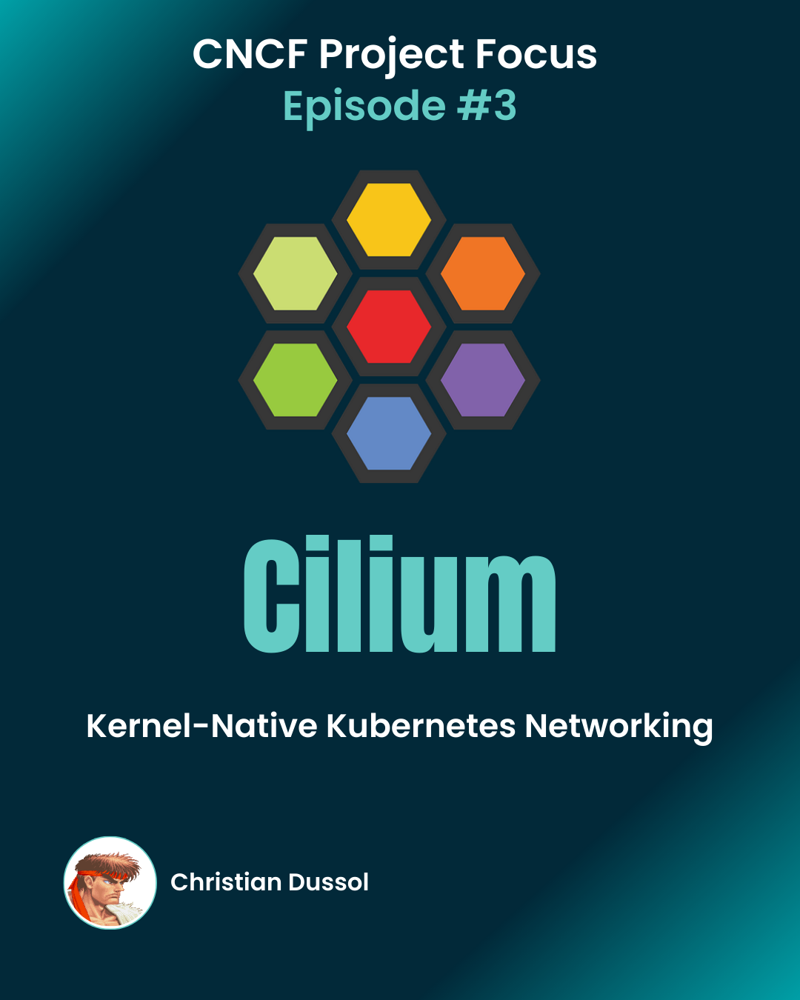

# Episode 3: Cillium

## **Kernel-Native Kubernetes Networking**

eBPF is the technology that quietly rewrote the Kubernetes networking layer. This episode dissects Cilium as the reference implementation: what it replaces, what it enables and the common misconception about where iptables actually lives.

<figure><figcaption></figcaption></figure>

### 📎Visual companion

[CNCF Project Focus #3: Cilium carousel (PDF)](https://github.com/christian-dussol-cloud-native/cilium/blob/main/carousel/CNCF%20Project%20Focus%20%233%20-%20Cilium.pdf)

### **What the episode covers**

* eBPF fundamentals without the marketing gloss
* kube-proxy replacement and why that matters at scale
* Network policy enforcement at kernel speed
* The iptables confusion: userspace configuration vs. kernel execution

### **Read the deep-dive**

* **Medium article** (published in AWS in Plain English): [Cilium — Eliminating the hidden network overhead in Kubernetes](https://aws.plainenglish.io/cilium-eliminating-the-hidden-network-overhead-in-kubernetes-cfa6ac10d084)
* **GitHub lab**: [github.com/christian-dussol-cloud-native/cilium](https://github.com/christian-dussol-cloud-native/cilium)
